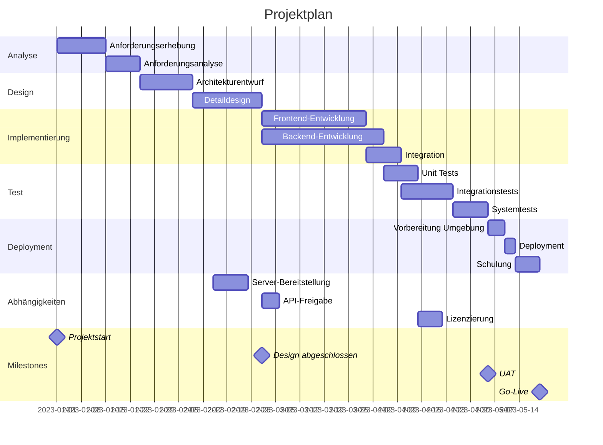
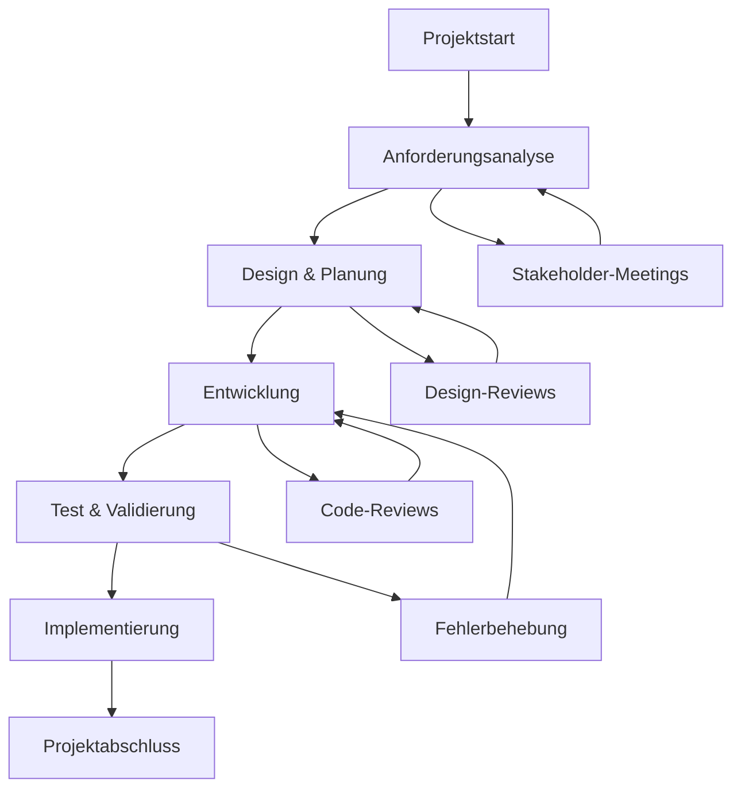
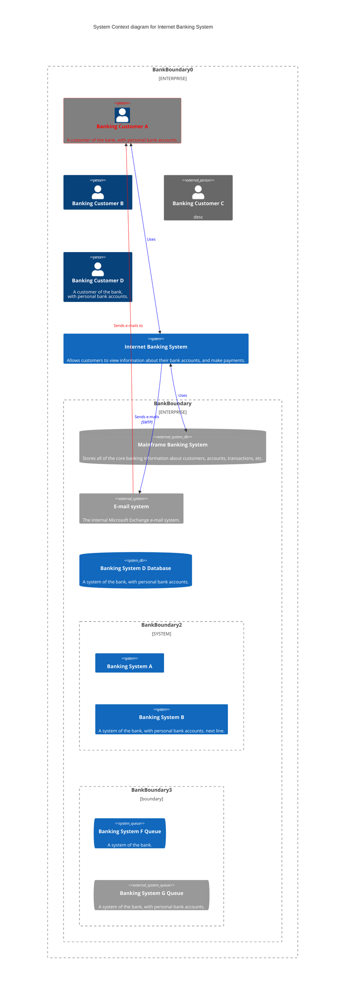

# Zielsetzung
Was ist das Problem?
Kurzbeschreibung des Geschäfts- oder Technikproblems, das gelöst werden soll.

# Organisation
## Team
Wer ist im Team? Welche Rollen gibt es? Wer ist der Product Owner, Scrum Master, Entwickler, Tester, Architekt?

## Grobplan
Grober Projektplan. Phasen, Meilensteine, Abhängigkeiten, aktuell geplantes GoLive-Datum.
Gant mermaid

Alternativ für einfachere Pläne oder etwas spezifischere Vorgehen geht auch ein Flow Chart

Wann sind welche Ressourcen verfügbar, benötigt oder nicht verfügbar.

Wo und wie werden Arbeitspackete gemanaged?

# Kontext
Was ist der Kontext des Problems/der Lösung?

Idealerweise ein Kontext Diagramm mit folgenden Informationen:
Die Lösung ist als Blackbox repräsentiert. Wer benutzt die Lösung? Wer interagiert mit der Lösung? Welche Systeme sind beteiligt? 

# Lösungsstrategie
Kurze Beschreibung der Lösungsansätze. Mit welchen Ansätzen soll das Problem gelöst werden?

## Lösungsansatz 1

# Architektur
## Komponentensicht

## Deploymentsicht

## Verhaltenssicht

## Datenmodell
