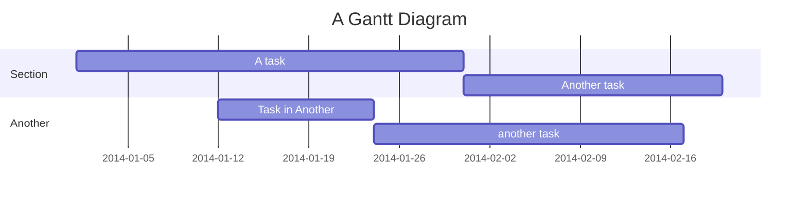

# Zielsetzung
Was ist das Problem?
Kurzbeschreibung des Geschäfts- oder Technikproblems, das gelöst werden soll.

# Organisation

Projektplan. Phasen, Meilensteine, Abhängigkeiten,
Gant mermaid

Ressourcen.

Wo und wie werden Arbeitspackete gemanaged?

Release Planung

Evnetuell eine Flow.

# Lösung

Kurze Beschriebung der Lösungsansätze. Mit welchen speziellen Entscheidungen möchte man das Ziel erreichen.

# Architektur
## Komponentensicht

## Deploymentsicht

## Verhaltenssicht 

